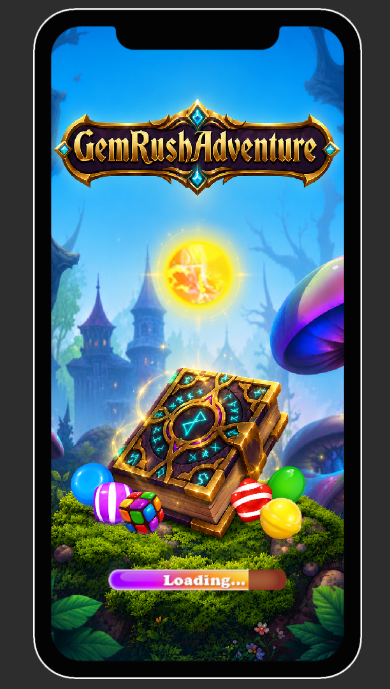
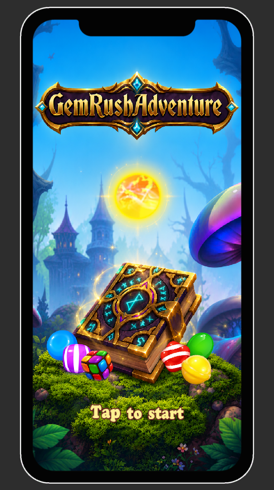
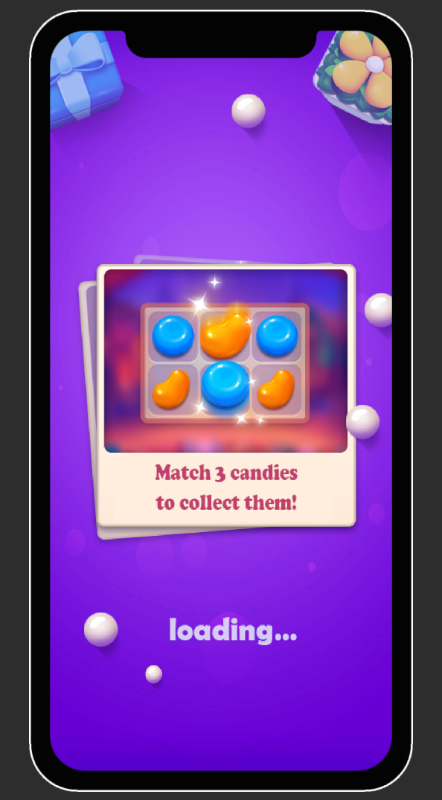
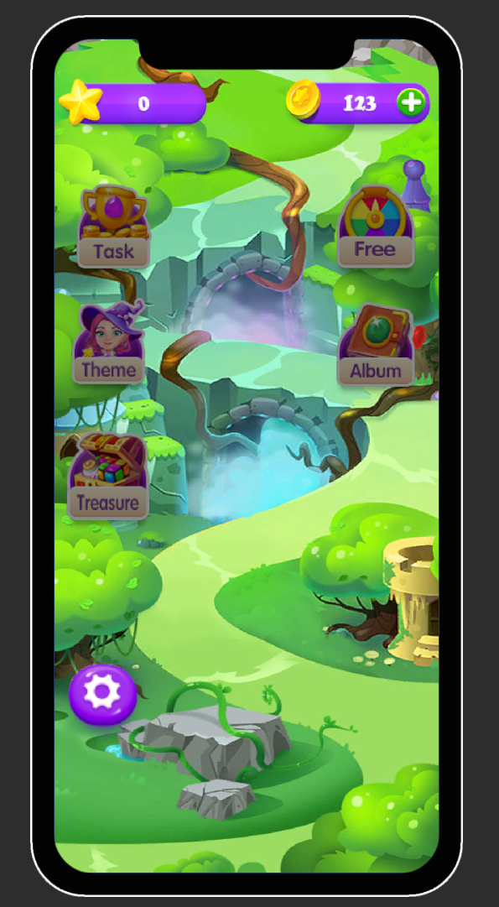
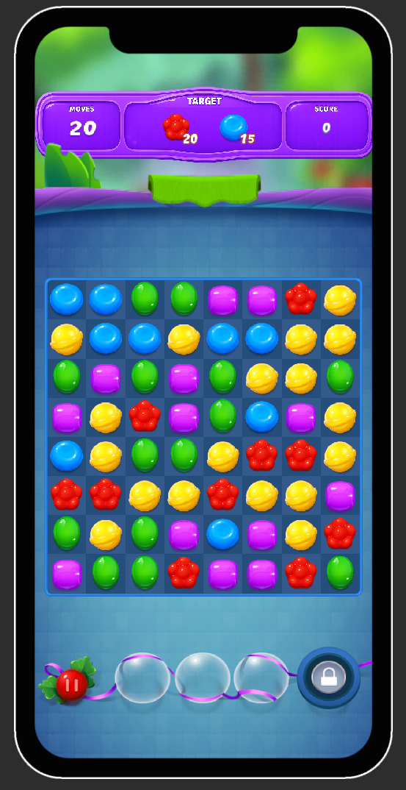

# Gem Rush Adventure

A colorful Match-3 puzzle game built with Unity, featuring handcrafted levels, a world map progression system, and polished UI animations.

## 🎮 Gameplay

- Swap adjacent gems to create matches.
- Complete level objectives.
- Earn up to 3 stars for each level.
- Collect coins and unlock new stages.
- Progress through a magical adventure world.

## ✨ Features

- Match-3 core mechanics
- Cascade & chain reactions
- Special gems and boosters
- Level progression system
- 3-star rating system
- Coin reward system
- JSON Save/Load system
- Animated UI with DOTween
- Scrollable world map
- Loading & transition scenes

## 🛠️ Tech Stack

- Unity 6
- C#
- DOTween
- JSON Serialization

## 📂 Project Structure

```text
Assets
├── Scripts
├── Prefabs
├── SO
├── Sprites
├── Scenes
└── Resources
```

## 🚀 How to Run

1. Open the project using Unity Hub.
2. Open `BootScene`.
3. Press Play.

## 📸 Screenshots

### Boot Scene (Loading)



---

### Boot Scene (Ready)



---


### Loading Scene



---

### Home Scene



---

### Gameplay



## 🔮 Planned Features

- More levels
- Additional worlds
- Daily rewards
- Achievement system
- Settings improvements
- Sound & music options
- New special gems

## 👨‍💻 Author

Developed by Khanh using Unity and C#.